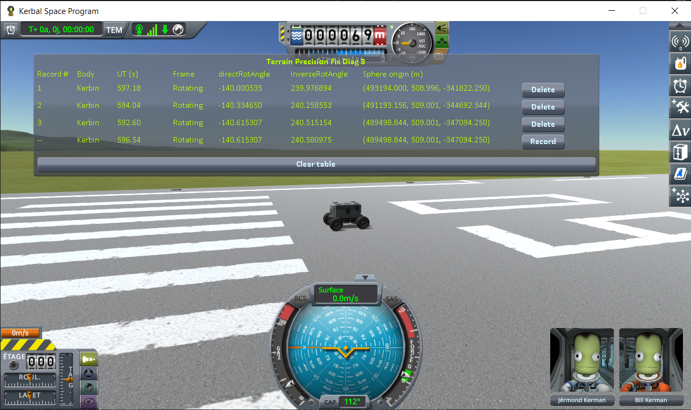
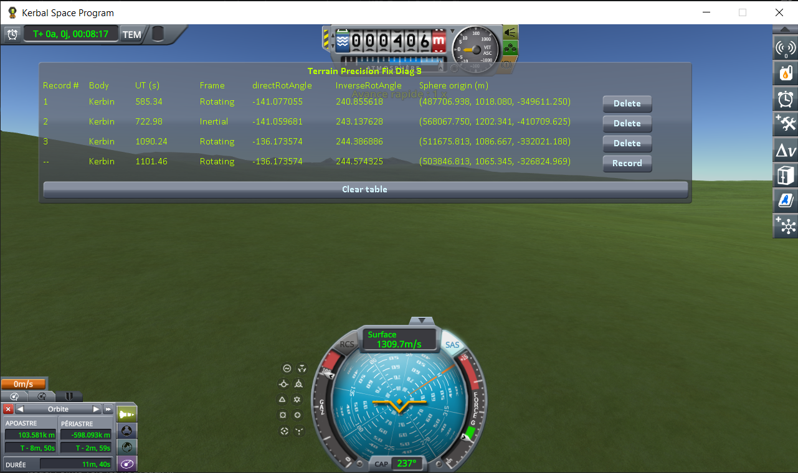
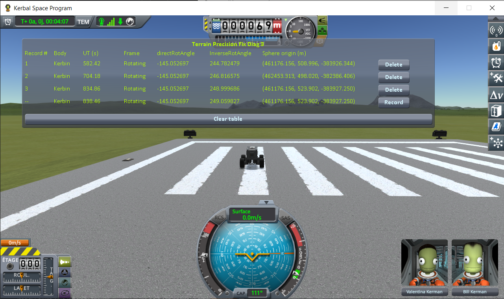

# Terrain Precision Fix - Diagnostic Mod 3

**⚠️ Work in progress.** This is an active investigation, not a finished mod. The code and this page can still change, and several questions are still open.

A measuring instrument for KSP 1.12. It shows, on your own install, the world frame the terrain of a
body is built in: how the body is turned in Unity's world axes, and where it sits in them. It records
that frame whenever you ask, so that you can compare it from one loading to the next, and from one
moment of a flight to another.

**How this was made.** Written with Claude, Anthropic's AI assistant, and reviewed line by line by a
human — me. I am saying so up front, because contributions made with an AI deserve a closer look than
others, and because some people would rather stop reading here. That look is easy to give here: this
mod changes nothing in the game and reads five values the game already holds, the source is a few
hundred lines, and the protocol runs on a stock install with no dependency of any kind.

## What it measures

**Unity is precise near zero, not far from it.** Unity, the engine KSP runs on, places every object
with `float` coordinates: about seven significant digits. Near the origin of the world, that is far
more precision than anyone needs. 600 km away, the smallest step between two positions is already a
few centimetres.

**So KSP keeps the craft near zero, and moves the universe instead.** The origin of Unity's world is
kept on the active craft. When the craft gets too far from it — about 500 m — KSP shifts the origin
back onto the craft, and moves everything else by the same amount. This is called the *floating
origin*. The centre of Kerbin, meanwhile, sits some 600 km away from that origin, wherever the last
shift left it.

**And it turns either the planet or the sky.** Kerbin rotates, and KSP has two ways of showing it. Below
100 km, the planet stays still in Unity's axes and the rest of the universe — the Sun, the other
worlds, the orbits — turns around it: a craft parked on the ground then does not have to be moved at
every frame. Above 100 km, it is the other way round: the planet turns, and the rest stays put. The
window calls the first one `Rotating` and the second one `Inertial`, the names KSP uses.

**The ground is built in that frame.** The terrain of a body hangs from one Unity object, its terrain
sphere (`PQS`). Every piece of ground, and the collision surface your landing gear touches, is placed
relative to it. That object has a position, **Sphere origin**, which the floating origin moves, and an
orientation, **directRotAngle**, which the rotation of the planet moves. Those two values are what this
mod calls the frame the terrain is built in. Built twice in the same frame, the ground comes out the
same; in two different frames, it comes out rounded differently, and a craft parked on it can end up a
few centimetres above or below it — [why, on the page of the
fix](https://github.com/lhervier/KSP-TerrainPrecisionFix/blob/master/docs/the-culprit.md#why-it-is-different-at-every-load).

This mod shows those two values, so that you can see when they change.

## The window

A table, one line per record, and a line in progress at the bottom that follows the game live.

| Column | What it shows |
|---|---|
| **Record #** | The line's number. |
| **Body** | The body of the active vessel. Every other column is about this body. |
| **UT (s)** | The game clock. |
| **Frame** | `Rotating` when the body stays still in the world axes and the rest of the universe turns around it; `Inertial` when the body turns in the world axes. |
| **directRotAngle** | `CelestialBody.directRotAngle`: the angle the body is turned by in the world axes, in degrees. |
| **InverseRotAngle** | `Planetarium.InverseRotAngle`: the angle the rest of the universe is turned by, in degrees. |
| **Sphere origin (m)** | The world position of the body's terrain sphere (`PQS`), in metres, as Unity holds it. |

Stock splits a body's rotation between the two angles, in `CelestialBody.CBUpdate`: their sum is the
body's rotation at the current UT, the only one that means anything physically. In a `Rotating` frame,
`directRotAngle` stays put and `InverseRotAngle` takes up the rotation; in an `Inertial` frame, it is
the other way round. How the rotation is split is written nowhere in the save.

Angles are shown to the millionth of a degree, as the game holds them, without bringing them back into
any range. At the radius of Kerbin, a millionth of a degree is about a centimetre on the ground.

The table survives scene changes, so that loading a save several times builds it up line by line.
`Delete` removes one line, `Clear table` removes them all.

## The protocol

The frame has two inputs, the orientation and the position of the terrain sphere. Each case makes
one of them move, in a situation every player meets:

| case | what moves | anything loaded? | in play |
|---|---|---|---|
| 1. The same save, loaded twice | the orientation | yes | loading a game |
| 2. A rocket above 100 km and back | the orientation | no | coming down from orbit to land near a base |
| 3. A rover driven 2 km and back | the position | no | driving to a base, or coming within range of it |

Case 1 is the only one where something is loaded, so it is the only one a change made at loading
could reach. Cases 2 and 3 show what happens after that.

The two craft it uses are in [`craft/`](craft/): copy
[`Diag3-Rover.craft`](craft/Diag3-Rover.craft) into the `Ships/SPH` folder of a sandbox game, and
[`Diag3-Rocket.craft`](craft/Diag3-Rocket.craft) into its `Ships/VAB` folder.

**1. Loading the same save twice.** Put `Diag3-Rover` on the runway, press **Record** and quicksave
(F5). Wait about ten seconds, quickload (hold F9) and press **Record**. Wait about ten seconds again,
quickload and press **Record**. Compare the three lines.

**2. Leaving the rotating frame and coming back, in one flight.** Put `Diag3-Rocket` on the launch
pad. It is a sounding rocket that climbs just above 100 km, where the frame of Kerbin stops being
`Rotating`. It has no decoupler: its crew does not survive the landing.

Press **Record** on the pad. Launch straight up at full throttle, and press **Record** once **Frame**
reads `Inertial`. Let it fall back, and press **Record** again once **Frame** reads `Rotating`, before
it hits the ground. Compare the lines: no save was loaded between them.

**3. Travelling more than 500 m on the ground.** Put `Diag3-Rover` on the runway and press
**Record**. Drive to the far end of the runway, stop and press **Record**, then drive back to where
you started, stop and press **Record** again. Compare the three lines: no save was loaded, and the
frame never left `Rotating`.

## The measurements

The three cases of the protocol, played in that order in one session, on KSP 1.12.5 with both
expansions, [KSP Community Fixes](https://github.com/KSPModdingLibs/KSPCommunityFixes) and Harmony,
which it needs, and nothing else in `GameData` but this mod. The game's interface is in French. The
bottom line of each table is the reading in progress, not a record.

**Case 1.** `Diag3-Rover` on the runway: one record after rollout, then one after each of two
quickloads of the same quicksave, about ten seconds apart.

| record | UT (s) | directRotAngle | Sphere origin (m) |
|---|---|---|---|
| 1, after rollout | 597.18 | -140.000535 | (493194.000, 508.996, -341822.250) |
| 2, after the first quickload | 594.04 | -140.334650 | (491193.156, 509.001, -344692.344) |
| 3, after the second quickload | 592.60 | -140.615307 | (489498.844, 509.001, -347094.250) |

The UT goes back a little on every line: each quickload puts the clock back to the quicksave.

**Case 2.** `Diag3-Rocket` from the launch pad, straight up at full throttle: one record on the pad,
one once **Frame** read `Inertial`, one once it read `Rotating` again, on the way down.

| record | UT (s) | Frame | directRotAngle | InverseRotAngle |
|---|---|---|---|---|
| 1, on the pad | 585.34 | Rotating | -141.077055 | 240.855618 |
| 2, above the threshold | 722.98 | Inertial | -141.059681 | 243.137628 |
| 3, back below it | 1090.24 | Rotating | -136.173574 | 244.386886 |

Between lines 1 and 3, `directRotAngle` moved by 4.903481°: Kerbin's rotation over 293.5 s.

**Case 3.** `Diag3-Rover` on the runway: one record at the start, one at the far end of the runway,
one back at the start.

| record | directRotAngle | Sphere origin (m) |
|---|---|---|
| 1, at the start | -145.052697 | (461176.156, 508.996, -383926.344) |
| 2, at the far end | -145.052697 | (462453.313, 498.020, -382386.406) |
| 3, back at the start | -145.052697 | (461176.156, 523.902, -383927.250) |

Lines 1 and 3 are 14.9 m apart in **Sphere origin**.

## What the measurements show

Any change of the frame, however small, rounds the ground differently. At the distance **Sphere
origin** sits at, one step of a `float` is a few centimetres: that is the scale the figures below are
to be read against.

**Loading a save does not give back the frame it was saved in.** In case 1, the same quicksave, loaded
twice, gives three different angles. Each quickload moved `directRotAngle` back by 0.334115° then
0.280657°: Kerbin's rotation over exactly 20.00 s and 16.80 s, the time spent in flight since the
previous save or loading. The frame a save comes back in depends on how long the game ran before it
was loaded, which the save knows nothing about. The terrain sphere moved by 3.5 km, then 2.9 km:
about a hundred thousand steps of a `float` each time.

**The frame also changes during a flight, with nothing loaded.** In case 2, `directRotAngle` stays put
while the rocket is below 100 km and follows the clock above it: on the way back down, it was
4.903481° further than on the pad, Kerbin's rotation over the 293.5 s spent above. The craft that lands
there finds a frame that depends on its trajectory. In case 3, the angle never moves, but **Sphere
origin** does: back at the very spot it started from, the rover finds the terrain sphere 14.9 m from
where it was, because the world origin follows the craft in jumps, and where the last jump happened
depends on the way it drove (see the floating origin, above). Both are ordinary play: coming down from orbit, driving to a base. The
ground built on the way, or when a parked craft comes within range, is built in that frame.

## Get it

**Compile it** — clone this repository, set `KSPDIR` to your KSP install folder and run `build.bat`.
It needs the .NET SDK, takes a few seconds, reads the KSP assemblies straight from your install, and
puts the DLL in `GameData/TerrainPrecisionFixDiag3Mod/` inside the repository. It does not install
anything.

## Install

Drop `GameData/TerrainPrecisionFixDiag3Mod` into the `GameData` of KSP, so that you end up with
`GameData/TerrainPrecisionFixDiag3Mod/TerrainPrecisionFixDiag3Mod.dll`. It runs on a stock install:
no Harmony, no ModuleManager, no dependency of any kind.

It reads the world and writes nothing at all: the table lives in memory and is gone when you close the
game. Your saves are never touched. Removing the folder removes the mod.

## License

MIT
