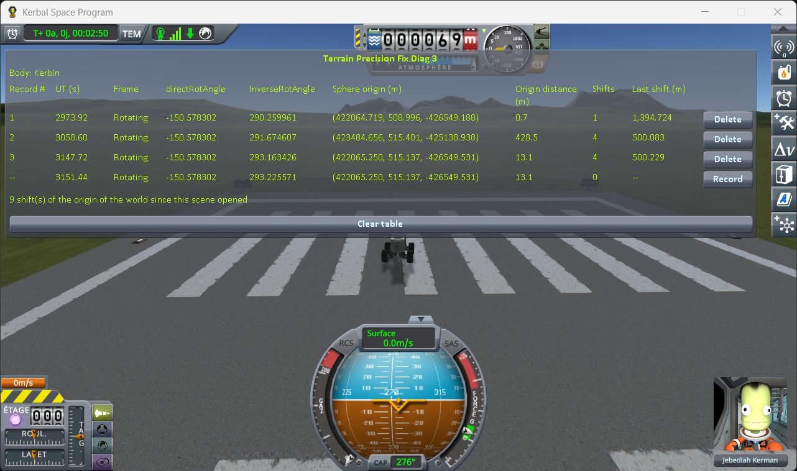

# The measurements

Part of [Terrain Precision Fix Diag 3](../README.md): the four cases of [the protocol](the-protocol.md),
played on stock. What they show is in [What the measurements show](what-the-measurements-show.md).

All four cases were played in that order, on KSP 1.12.5 with both expansions, [KSP Community
Fixes](https://github.com/KSPModdingLibs/KSPCommunityFixes) and the two mods it needs, Harmony and
ModuleManager, and nothing else in `GameData` but this mod. The game's interface is in French. The
bottom line of each table is the reading in progress, not a record.

## Case 1: loading the same save three times

`Diag3-Rover` on the runway, quicksaved right after rollout, then quickloaded three times, about ten
seconds apart, with one record after each quickload.

| record | UT (s) | directRotAngle | Sphere origin (m) | Shifts | Last shift (m) |
|---|---|---|---|---|---|
| 1, after the first quickload | 2821.12 | -140.000535 | (493194.000, 508.996, -341822.250) | 1 | 1,394.781 |
| 2, after the second quickload | 2832.84 | -140.227733 | (491835.594, 508.999, -343775.063) | 1 | 125,189.961 |
| 3, after the third quickload | 2825.66 | -140.533449 | (489994.281, 508.999, -346394.469) | 1 | 168,454.914 |

Each quickload puts the clock back to the date of the quicksave: the UT of every line is that date,
plus the seconds waited before pressing **Record**. Each quickload shifted the world origin once.

**→ What it shows: [Loading a save does not give back the frame it was saved in](what-the-measurements-show.md#loading-a-save-does-not-give-back-the-frame-it-was-saved-in)**

## Case 2: leaving the rotating frame and coming back, in one flight

`Diag3-Rocket` from the launch pad, SAS on, straight up at full throttle: one record on the pad, one
once **Frame** read `Inertial`, one once it read `Rotating` again, on the way down.

| record | UT (s) | Frame | directRotAngle | InverseRotAngle | Shifts | Last shift (m) |
|---|---|---|---|---|---|---|
| 1, on the pad | 2909.36 | Rotating | -140.533449 | 279.136583 | 1 | 448.362 |
| 2, above the threshold | 3044.20 | Inertial | -140.521755 | 281.377497 | 5368 | 18.788 |
| 3, back below it | 3338.72 | Rotating | -135.629968 | 281.405897 | 14726 | 18.949 |

**Frame** changed at exactly 100 km on the altimeter. Between lines 1 and 3, `directRotAngle` moved by
4.903481°: Kerbin's rotation over 293.5 s. In flight, the world origin was shifted 20,094 times, by
about 19 m each time.

**→ What it shows: [The frame also changes during a flight, with nothing loaded](what-the-measurements-show.md#the-frame-also-changes-during-a-flight-with-nothing-loaded)**

## Case 3: a rover near a parked craft, then on its own

`approach-kerbin`, one drive: one record at the start, one 100 m from the capsule, one once the capsule
was unloaded, one after the next shift.

| record | UT (s) | Sphere origin (m) | Origin distance (m) | Shifts | Last shift (m) |
|---|---|---|---|---|---|
| 1, at the start | 2475.56 | (421804.531, 3330.629, -426782.406) | 0.2 | 1 | 8,176,448.324 |
| 2, 100 m from the capsule | 2590.62 | (421804.531, 3330.629, -426782.406) | 1,901.2 | 0 | -- |
| 3, capsule unloaded | 2724.48 | (421790.531, 3860.959, -426792.281) | 138.6 | 1 | 530.606 |
| 4, after the next shift | 2837.00 | (421825.688, 4359.731, -426788.531) | 48.0 | 1 | 500.025 |

The shift of line 1 is the one made by loading the save. **Origin distance** is read once the rover
has stopped, a little after the shift of lines 3 and 4.

**→ What it shows: [The world origin moves by 500 m at a time, and not at all near a parked craft](what-the-measurements-show.md#the-world-origin-moves-by-500-m-at-a-time-and-not-at-all-near-a-parked-craft)**

## Case 4: a rover driven 2 km and back

`Diag3-Rover` on the runway: one record at the start, one at the far end of the runway, one back at
the start.

| record | directRotAngle | Sphere origin (m) | Origin distance (m) | Shifts | Last shift (m) |
|---|---|---|---|---|---|
| 1, at the start | -150.578302 | (422064.719, 508.996, -426549.188) | 0.7 | 1 | 1,394.724 |
| 2, at the far end | -150.578302 | (423484.656, 515.401, -425138.938) | 428.5 | 4 | 500.083 |
| 3, back at the start | -150.578302 | (422065.250, 515.137, -426549.531) | 13.1 | 4 | 500.229 |

The shift of line 1 is the one made by the rollout. Lines 1 and 3 are 6.2 m apart in **Sphere origin**.

**→ What it shows: [The frame also changes during a flight, with nothing loaded](what-the-measurements-show.md#the-frame-also-changes-during-a-flight-with-nothing-loaded)**
