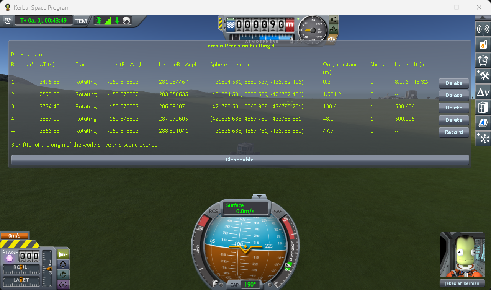

# What it measures

Part of [Terrain Precision Fix Diag 3](../README.md): the world frame the terrain is built in, why it
moves, and what the window shows of it. How to fill the window is in [The protocol](the-protocol.md).

**Unity is precise near zero, not far from it.** Unity, the engine KSP runs on, places every object
with `float` coordinates: about seven significant digits. Near the origin of the world, that is far
more precision than anyone needs. 600 km away, the smallest step between two positions is already a
few centimetres.

**So KSP keeps the craft near zero, and moves the universe instead.** The origin of Unity's world is
kept on the active craft. When the craft has drifted far enough from it, KSP shifts the origin back
onto the craft, and moves everything else by the same amount; a craft going fast drags it along
almost continuously ([case 2](the-measurements.md#case-2-leaving-the-rotating-frame-and-coming-back-in-one-flight)).
This is called the *floating origin*. The centre
of Kerbin, meanwhile, sits some 600 km away from that origin, wherever the last shift left it.

**Except near a parked craft.** While another craft is landed and loaded, KSP does not shift the
origin at all, however far the active craft goes (`Krakensbane.SafeToEngage`). Once you are far
enough for that craft to be unloaded, the origin catches up with you, all at once. How far, in both
cases, is measured in [case 3](the-measurements.md#case-3-a-rover-near-a-parked-craft-then-on-its-own).

**And it turns either the planet or the sky.** Kerbin rotates, and KSP has two ways of showing it. Close
to the planet, it stays still in Unity's axes and the rest of the universe — the Sun, the other
worlds, the orbits — turns around it: a craft parked on the ground then does not have to be moved at
every frame. Further out, it is the other way round: the planet turns, and the rest stays put. KSP
calls the first one `Rotating` and the second one `Inertial`. The altitude of the switch is measured
on Kerbin, in [case 2](the-measurements.md#case-2-leaving-the-rotating-frame-and-coming-back-in-one-flight).

**The ground is built in that frame.** The terrain of a body hangs from one Unity object, its terrain
sphere (`PQS`). Every piece of ground, and the collision surface your landing gear touches, is placed
relative to it. That object has a position, **Sphere origin**, which the floating origin moves, and an
orientation, **directRotAngle**, which the rotation of the planet moves. Those two values are what this
mod calls the frame the terrain is built in. What that frame does to the ground is on [the page of the
fix](https://github.com/lhervier/KSP-TerrainPrecisionFix/blob/master/docs/the-culprit.md#why-it-is-different-at-every-load).

## The window

The mod shows those two values, and everything that moves them: which way the rotation is shown, how
far it has gone, and where the world origin is. A table, one line per record, and a line in progress
at the bottom that follows the game live.

*[Case 3](the-measurements.md#case-3-a-rover-near-a-parked-craft-then-on-its-own): `Diag3-Rover` driven
from the start of `approach-kerbin` to the capsule, then south until it was unloaded, and on to the
next shift of the world origin.*

Above the table, **Body** names the body of the active vessel: every column is about this body.

| Column | What it shows |
|---|---|
| **Record #** | The line's number. |
| **UT (s)** | The game clock. |
| **Frame** | `Rotating` when the body stays still in the world axes and the rest of the universe turns around it; `Inertial` when the body turns in the world axes. |
| **directRotAngle** | `CelestialBody.directRotAngle`: the angle the body is turned by in the world axes, in degrees. |
| **InverseRotAngle** | `Planetarium.InverseRotAngle`: the angle the rest of the universe is turned by, in degrees. |
| **Sphere origin (m)** | The world position of the body's terrain sphere (`PQS`), in metres, as Unity holds it. |
| **Origin distance (m)** | How far the craft you are flying is from the origin of Unity's world. |
| **Shifts** | How many times KSP has moved that origin since the previous line. |
| **Last shift (m)** | How far the last of those moves carried the origin, to the millimetre; `--` when there was none. |

Stock splits a body's rotation between the two angles, in `CelestialBody.CBUpdate`: their sum is the
body's rotation at the current UT, the only one that means anything physically. In a `Rotating` frame,
`directRotAngle` stays put and `InverseRotAngle` takes up the rotation; in an `Inertial` frame, it is
the other way round. How the rotation is split is written nowhere in the save.

Angles are shown to the millionth of a degree, as the game holds them, without bringing them back into
any range. At the radius of Kerbin, a millionth of a degree is about a centimetre on the ground.

**Sphere origin** is read in the origin of Unity's world, so a shift of that origin is what makes
that column jump although nothing has moved in the world: **Last shift** is the size of that jump.
Under the table, one line counts the shifts since the scene opened.

The table survives scene changes, so that loading a save several times builds it up line by line.
`Delete` removes one line, `Clear table` removes them all.
